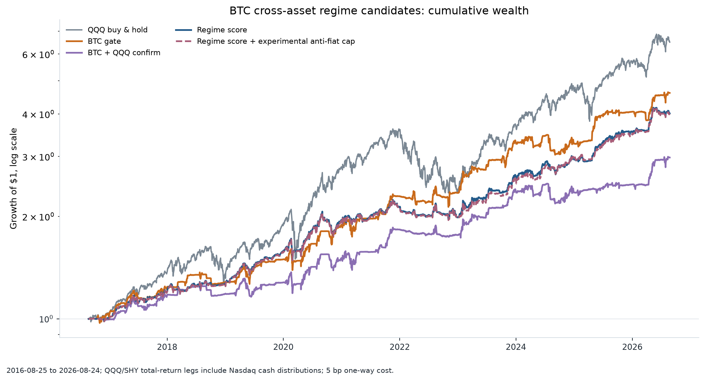
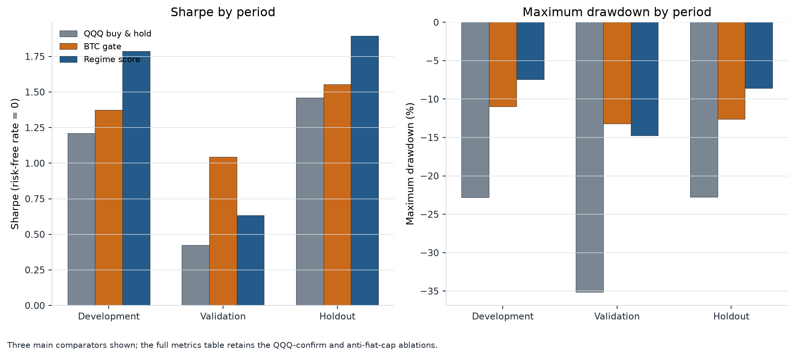
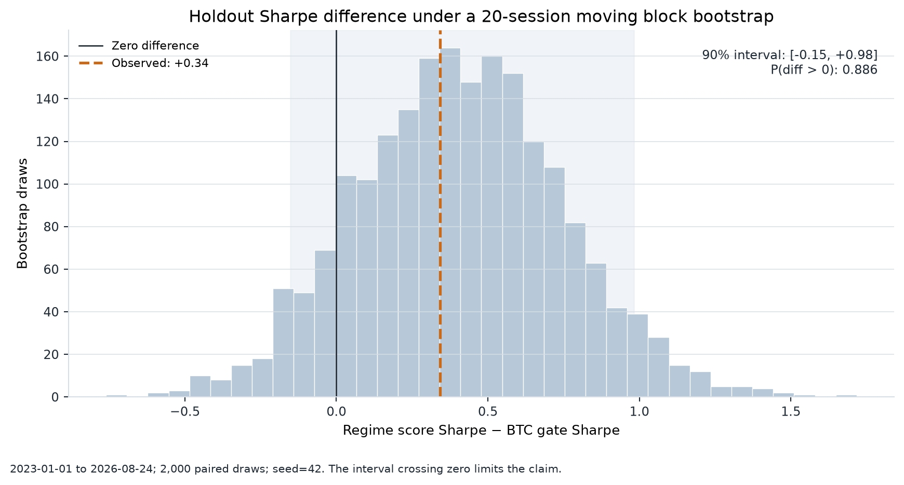

# BTC Cross-Asset Regime Research

## 我的角色

- 提出并拆解“BTC 上涨是否等于美股 risk-on”这个研究问题
- 决定跨资产状态变量、时间切分、成本假设和留出期验证方式
- Codex 加速实现与复算；是否接受结果、保留哪些失败证据由我判断

_English summary: test BTC as a risk sensor after conditioning on equity, dollar, gold, and long-bond trends._

> **TL;DR**：检验「BTC 上涨 = 美股 risk-on」这一隐含判断。加入美元、黄金、
> 长债方向的 Regime score 在开发期与留出期夏普高于原始 BTC gate（留出期差
> **+0.34**，正差概率 0.886），但验证期从 1.04 降至 0.63——改进依赖市场状态。
> 结论是「值得继续验证」，不是「已证明有效」。完整限制见「哪些地方没有成功」。

原始规则很简单：BTC 站上 SMA50 且 20 日动量为正，就持有 QQQ，否则持有 SHY。它隐含了一个强判断——BTC 上涨就是美股 risk-on。这份研究只检查这个判断在不同市场状态下是否站得住，并没有把一个更复杂的参数组合包装成最终策略。

## 具体怎么做

我保留原始 `BTC gate`，再加入两个对照：QQQ 自身趋势确认，以及包含美元、黄金和长债方向的 `Regime score`。每周五（或当周最后一个交易日）锁定信号，下一交易时段才换仓；组合只在 QQQ 与 SHY 之间配置，风险仓位为 0%、50% 或 100%，报告收益按单边 5bp 扣交易成本。

这里用的只有每日收盘价，所以代码把下一个交易日当成换仓日，不把前一收盘到换仓日收盘的涨跌算成策略收益。新持仓从换仓后的下一个收盘区间开始计收益。这样会保守一点，但不用假装自己知道一个并不存在的数据内成交价。

时间被切成三个部分：2016—2019 是开发期，2020—2022 是验证期，2023—2026-08-24 是留出期。BTC 使用 Coin Metrics `PriceUSD`，ETF 收盘价和 QQQ/SHY 分红来自 Nasdaq；数据边界和下载入口见 [`data/README.md`](data/README.md)。

## 先看三张图



累计财富用对数纵轴。QQQ buy-and-hold 的绝对财富最高；评分模型的意义主要在于较低的暴露和回撤，而不是超过 QQQ 的绝对收益。反法币 cap 用虚线画出，作为实验消融项。



开发期和留出期，`Regime score` 的夏普高于 `BTC gate`；验证期却从 1.04 降到 0.63。这个分裂比全样本 1.34 对 1.29 更值得关注：改进依赖市场状态，不能直接称为稳定胜出。右图也显示模型回撤较低，但这不是没有成本的保护。



留出期观测到的夏普差是 **+0.34**，2,000 次 20-session moving-block bootstrap 的 90% 区间为 **-0.15 至 +0.98**，正差概率为 **0.886**。分布仍覆盖零，所以这张图支持“继续验证”，不支持“已经证明有效”。

## 哪些地方没有成功

“BTC 和黄金上涨、美元与 QQQ 下跌”的短期组合确实能标出反法币背离，但其后 20 个交易日 QQQ 收益并没有稳定变差，不能直接改写成做空或清仓规则。QQQ/SHY 的 ETF 收盘价也不是供应商调整后的完整总回报序列；BTC 全天交易而 ETF 只在美国交易时段交易；策略换手较高。

更大的问题是样本仍短，跨资产评分没有经过实时滚动训练，2020—2022 的验证表现也不支持把当前权重当成通用参数。这里的 Sharpe 使用零无风险利率，只用于同一口径的比较。它是研究代码，不是投资建议。

## 重跑

[](https://github.com/Praymo/btc-cross-asset-regime/actions/workflows/ci.yml)

仓库带有与结果表对应的公共数据缓存。直接复算和重新画图：

```bash
python -m venv .venv
source .venv/bin/activate
python -m pip install -r requirements.txt

# 使用缓存运行研究，并更新 outputs/holdout_sharpe_bootstrap.csv
python research.py
python scripts/render_figures.py

# 需要刷新数据时再运行；这会访问 Nasdaq 和 Coin Metrics
python scripts/download_data.py
python research.py

# 可选：执行清空过输出的 notebook，并把结果写到临时文件
jupyter nbconvert --to notebook --execute btc_cross_asset_regime_research.ipynb \
  --output /tmp/btc-regime-executed.ipynb
```

测试运行方式：`python -m unittest discover -s tests`

`outputs/full_sample_metrics.csv` 和 `outputs/metrics_by_period.csv` 保留绩效、风险暴露和换手；`outputs/holdout_sharpe_bootstrap.csv` 是图 3 的固定 seed=42 汇总。数据刷新后，源数据修订、API 限流和缺失行都可能改变结果。

## 文件

- `research.py`：数据读取、特征、周频持仓、成本、绩效和 bootstrap；直接运行会打印 coverage 与全样本指标。
- `btc_cross_asset_regime_research.ipynb`：从原始开关到跨资产评分的完整检查。
- `scripts/download_data.py`：刷新公开 BTC/ETF 缓存。
- `scripts/render_figures.py`：从缓存和既有计算生成上面的三张 PNG。
